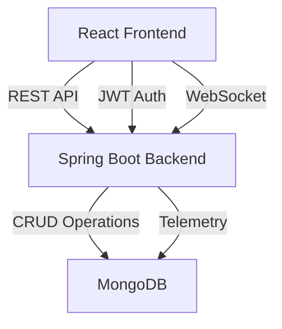

<div align="center">

# 🚛 NeuroFleetX

### _Intelligent Fleet Management System_

[](https://reactjs.org/)
[](https://spring.io/projects/spring-boot)
[](https://www.mongodb.com/)
[](LICENSE)

_A modern, full-stack fleet management solution with real-time GPS tracking, intelligent telemetry analytics, and seamless driver-fleet manager workflows._

[Features](#-features) • [Quick Start](#-quick-start) • [API Docs](#-api-reference) • [Contributing](#-contributing)

</div>

---

## 📋 Table of Contents

- [🌟 Features](#-features)
- [🏗️ Architecture](#️-architecture)
- [🚀 Quick Start](#-quick-start)
- [⚙️ Backend Setup](#️-backend-setup-spring-boot)
- [🎨 Frontend Setup](#-frontend-setup-react)
- [💾 Database Configuration](#-database-configuration)
- [🔌 API Reference](#-api-reference)
- [🔐 Authentication & Security](#-authentication--security)
- [🛠️ Troubleshooting](#️-troubleshooting)
- [🤝 Contributing](#-contributing)
- [📄 License](#-license)

---

## 📚 Documentation Policy

> **📌 Important:** All project documentation lives in this `README.md` file. Please do not create additional `.md` files. All future documentation updates should be made exclusively in this file.

---

## 🌟 Features

### 👥 Multi-Role System

- **Fleet Manager**: Complete oversight with driver management, vehicle assignments, and analytics
- **Driver**: Intuitive dashboard with trip controls and real-time tracking
- **Admin**: Full system access with data management capabilities

### 🎯 Core Capabilities

- ✅ **Smart Authentication** - JWT-based secure login with automatic driver registration
- 🚗 **Vehicle Management** - Add, edit, assign, and track vehicles across your fleet
- 📍 **Real-Time GPS Tracking** - Browser-based geolocation with 30-second refresh intervals
- 🗺️ **Interactive Maps** - Leaflet-powered visualization with live vehicle positions
- 🎮 **Trip Controls** - Start Trip • Take Break • Resume Trip • End Trip
- 📊 **Telemetry Analytics** - Historical data storage and retrieval via MongoDB
- 🔔 **Smart Notifications** - Customizable alerts and preference management
- 📱 **Responsive Design** - Sleek UI powered by Tailwind CSS and Material-UI
- 🔄 **Auto-Sync** - Automatic driver registration in fleet manager portal on signup

---

## 🏗️ Architecture



### 🎨 Frontend Stack

- **Framework**: React 18.2.0
- **State Management**: Context API (AuthContext, DataContext, ThemeContext)
- **HTTP Client**: Axios
- **Styling**: Tailwind CSS + Custom UI Components
- **Maps**: Leaflet / React-Leaflet
- **Animations**: Framer Motion

### ⚙️ Backend Stack

- **Framework**: Spring Boot 3.3.5
- **Language**: Java 24
- **Build Tool**: Maven
- **Architecture**: RESTful API with MVC pattern
- **Security**: JWT-based authentication

### 💾 Database

- **Type**: MongoDB (NoSQL)
- **Collections**: users, drivers, vehicles, telemetry, notifications
- **Features**: Time-series data, indexing, aggregation pipelines

---

## 🚀 Quick Start

### 📋 Prerequisites

Before you begin, ensure you have the following installed:

| Tool        | Version | Purpose                       |
| ----------- | ------- | ----------------------------- |
| ☕ Java JDK | 11+     | Backend runtime               |
| 📦 Maven    | 3.6+    | Backend dependency management |
| 💚 Node.js  | 16+     | Frontend runtime              |
| 📦 npm/yarn | Latest  | Frontend package manager      |
| 🍃 MongoDB  | 4.4+    | Database (local or Atlas)     |

### ⚡ Installation Steps

#### 1️⃣ Clone the Repository

```bash
git clone https://github.com/Bhuvan-1005/NeuroFleetX.git
cd NeuroFleetX
```

#### 2️⃣ Configure Backend

Navigate to `Backend-Java/src/main/resources/application.properties` and update:

```properties
spring.data.mongodb.uri=mongodb://localhost:27017/neurofleetx
jwt.secret=your-super-secret-key-here
server.port=8080
```

#### 3️⃣ Seed Database (Optional)

```bash
cd Backend-Java
mongosh < mongodb-init.js
```

#### 4️⃣ Start Backend

```bash
cd Backend-Java
# Windows
mvnw.cmd spring-boot:run

# Linux/Mac
./mvnw spring-boot:run
```

Backend will run on `http://localhost:8080` 🚀

#### 5️⃣ Start Frontend

```bash
cd Frontend
npm install
npm start
```

Frontend will run on `http://localhost:3000` 🎨

#### 6️⃣ Access the Application

Open your browser and navigate to:

- **Frontend**: http://localhost:3000
- **Backend API**: http://localhost:8080
- **Health Check**: http://localhost:8080/actuator/health

---

## ⚙️ Backend Setup (Spring Boot)

### 📁 Project Structure

```
Backend-Java/
├── src/main/java/com/neurofleetx/
│   ├── NeurofleetxApplication.java    # 🚪 Application Entry Point
│   ├── config/
│   │   └── CorsConfig.java            # 🔐 CORS Configuration
│   ├── controller/                     # 🎮 REST Controllers
│   │   ├── AuthController.java
│   │   ├── DriverController.java
│   │   ├── VehicleController.java
│   │   ├── TelemetryController.java
│   │   └── NotificationController.java
│   ├── entity/                         # 📊 Data Models
│   │   ├── User.java
│   │   ├── Driver.java
│   │   ├── Vehicle.java
│   │   └── Telemetry.java
│   ├── repository/                     # 💾 MongoDB Repositories
│   ├── service/                        # 🛠️ Business Logic
│   └── resources/
│       └── application.properties      # ⚙️ Configuration
└── pom.xml                            # 📦 Maven Dependencies
```

### 🏗️ Build Commands

```bash
# Development mode
./mvnw spring-boot:run

# Build JAR
./mvnw clean package

# Run JAR
java -jar target/neurofleetx-0.0.1-SNAPSHOT.jar
```

---

## 🎨 Frontend Setup (React)

### 📁 Project Structure

```
Frontend/
├── src/
│   ├── components/                    # 🧩 Reusable Components
│   │   ├── LocationTracker.js        # 📍 GPS Tracking
│   │   ├── Map.js                    # 🗺️ Leaflet Map
│   │   ├── Navbar.js                 # 🧭 Navigation
│   │   └── ui/                       # ✨ UI Components
│   ├── pages/                        # 📄 Page Components
│   │   ├── Landing.js
│   │   ├── DriverDashboard.js
│   │   ├── FleetDashboard.js
│   │   └── DataManagementDashboard.js
│   ├── context/                      # 🌐 Global State
│   │   ├── AuthContext.js
│   │   ├── DataContext.js
│   │   └── ThemeContext.js
│   ├── services/                     # 🔌 API Services
│   │   └── api.js
│   └── App.js                        # 🚪 Root Component
├── package.json
└── tailwind.config.js
```

### 🎯 Key Components

#### 📍 LocationTracker.js

- **Purpose**: Real-time GPS tracking with 30-second intervals
- **Features**: Browser geolocation API, automatic telemetry push

#### 🎮 DriverDashboard.js

- **Purpose**: Driver interface with trip management
- **Features**: Trip controls, vehicle selection, live tracking

#### 🚗 FleetDashboard.js

- **Purpose**: Fleet manager overview
- **Features**: Driver list, vehicle assignments, analytics

### 🌍 Environment Variables

Create a `.env` file in the `Frontend/` directory:

```env
REACT_APP_API_URL=http://localhost:8080
REACT_APP_MAP_TILE_URL=https://{s}.tile.openstreetmap.org/{z}/{x}/{y}.png
```

---

## 💾 Database Configuration

### 📊 MongoDB Collections

| Collection      | Purpose                | Key Fields                           |
| --------------- | ---------------------- | ------------------------------------ |
| `users`         | Authentication & roles | email, password, role                |
| `drivers`       | Driver profiles        | name, licenseNumber, assignedVehicle |
| `vehicles`      | Vehicle metadata       | registrationNumber, type, status     |
| `telemetry`     | GPS & sensor data      | timestamp, location, speed           |
| `notifications` | Alert system           | userId, message, type, read          |

### 🔍 Recommended Indexes

```javascript
// Telemetry collection
db.telemetry.createIndex({ timestamp: -1 });
db.telemetry.createIndex({ vehicleId: 1, timestamp: -1 });

// Users collection
db.users.createIndex({ email: 1 }, { unique: true });

// Vehicles collection
db.vehicles.createIndex({ registrationNumber: 1 }, { unique: true });
```

### 🌱 Database Seeding

The `mongodb-init.js` script provides sample data:

- 5 sample vehicles
- 3 test users (fleet manager, driver, admin)
- Sample telemetry data

---

## 🔌 API Reference

### 🔐 Authentication Endpoints

#### Register User
```http
POST /api/auth/signup
Content-Type: application/json

{
  "email": "driver@example.com",
  "password": "securePass123",
  "name": "John Doe",
  "role": "DRIVER"
}
```
**Response**: `201 Created` - Automatically creates User + Driver entities

#### Login
```http
POST /api/auth/login
Content-Type: application/json

{
  "email": "driver@example.com",
  "password": "securePass123"
}
```
**Response**: `200 OK` with JWT token
```json
{
  "token": "eyJhbGciOiJIUzI1NiIsInR5cCI6IkpXVCJ9...",
  "role": "DRIVER",
  "userId": "64a5f8e9c2d4b5e6f7g8h9i0"
}
```

### 🚗 Vehicle Endpoints

| Method | Endpoint | Description | Auth Required |
|--------|----------|-------------|---------------|
| `GET` | `/api/vehicles` | List all vehicles | ✅ |
| `POST` | `/api/vehicles` | Create new vehicle | ✅ Admin |
| `PUT` | `/api/vehicles/{id}` | Update vehicle | ✅ Admin |
| `DELETE` | `/api/vehicles/{id}` | Delete vehicle | ✅ Admin |

### 👥 Driver Endpoints

| Method | Endpoint | Description | Auth Required |
|--------|----------|-------------|---------------|
| `GET` | `/api/drivers` | List all drivers | ✅ Fleet Manager |
| `GET` | `/api/drivers/{id}` | Get driver details | ✅ |
| `PUT` | `/api/drivers/{id}/assign-vehicle` | Assign vehicle to driver | ✅ Fleet Manager |

### 📊 Telemetry Endpoints

| Method | Endpoint | Description | Auth Required |
|--------|----------|-------------|---------------|
| `POST` | `/api/telemetry` | Submit telemetry data | ✅ Driver |
| `GET` | `/api/telemetry/vehicle/{id}` | Get vehicle telemetry | ✅ |
| `GET` | `/api/telemetry/recent` | Get recent telemetry | ✅ Fleet Manager |

### 🔔 Notification Endpoints

| Method | Endpoint | Description | Auth Required |
|--------|----------|-------------|---------------|
| `GET` | `/api/notifications` | Get user notifications | ✅ |
| `POST` | `/api/notifications` | Create notification | ✅ Admin |
| `PUT` | `/api/notifications/{id}/read` | Mark as read | ✅ |

---

## 🔐 Authentication & Security

### 🔑 JWT Implementation
```javascript
// Frontend - Axios Interceptor
axios.interceptors.request.use(config => {
  const token = localStorage.getItem('token');
  if (token) {
    config.headers.Authorization = `Bearer ${token}`;
  }
  return config;
});
```

### 🛡️ Security Features
- ✅ **JWT-based authentication** with configurable expiry
- ✅ **Role-based access control** (RBAC)
- ✅ **CORS configuration** for cross-origin requests
- ✅ **Password hashing** using BCrypt
- ✅ **Token validation** on every protected endpoint

### 🔒 CORS Configuration
Located in `Backend-Java/src/main/java/com/neurofleetx/config/CorsConfig.java`
```java
// Default allowed origins
http://localhost:3000  // Development
https://your-domain.com  // Production
```

---

## 💡 Developer Guidelines

### 📝 Code Conventions

#### Frontend
- **State Management**: Use `DataContext` for shared data (vehicles, drivers)
- **Component Structure**: Functional components with React Hooks
- **API Calls**: Centralized in `services/api.js`
- **Styling**: Tailwind CSS utility classes preferred

#### Backend
- **Architecture**: MVC pattern (Controller → Service → Repository)
- **Error Handling**: Custom exceptions with meaningful messages
- **Logging**: Comprehensive logging using SLF4J
- **Testing**: Unit tests for services, integration tests for controllers

### 🔄 Workflow Tips
1. **Driver Signup**: Automatically creates both `User` and `Driver` entities
2. **Trip Controls**: Status updates trigger GPS tracking on/off
3. **Vehicle Assignment**: Real-time sync between driver and fleet manager views
4. **Telemetry**: 30-second intervals when trip is active

---

## 🛠️ Troubleshooting

### ❌ Common Issues & Solutions

#### 🔴 ERR_CONNECTION_REFUSED
**Problem**: Frontend can't connect to backend
**Solution**:
1. Verify backend is running: `http://localhost:8080/actuator/health`
2. Check CORS configuration in `CorsConfig.java`
3. Ensure `REACT_APP_API_URL` in frontend `.env` is correct

#### 🔴 Vehicles Not Loading
**Problem**: Vehicle dropdown is empty
**Solution**:
1. Test API endpoint: `GET http://localhost:8080/api/vehicles`
2. Check MongoDB connection in `application.properties`
3. Verify JWT token is being sent in request headers
4. Run `mongodb-init.js` to seed sample vehicles

#### 🔴 Authentication Errors
**Problem**: Login fails or token expired
**Solution**:
1. Verify JWT secret matches in `application.properties`
2. Check token expiry settings (default: 24 hours)
3. Clear localStorage and login again
4. Ensure password meets minimum requirements

#### 🔴 GPS Tracking Not Working
**Problem**: Location not updating
**Solution**:
1. Grant browser location permissions
2. Use HTTPS in production (HTTP geolocation limited)
3. Check `LocationTracker.js` interval (default: 30s)
4. Verify trip status is "ACTIVE"

### 🐛 Debug Mode
Enable verbose logging in `application.properties`:
```properties
logging.level.com.neurofleetx=DEBUG
logging.level.org.springframework.web=DEBUG
```

---

## 🤝 Contributing

We welcome contributions! Here's how you can help:

### 🌿 Branch Strategy
```bash
# Create feature branch
git checkout -b feature/your-feature-name

# Create bugfix branch
git checkout -b bugfix/issue-description
```

### 📤 Pull Request Process
1. Fork the repository
2. Create your feature branch
3. Commit your changes with meaningful messages
4. Push to your fork
5. Open a Pull Request to `master` branch

### ✅ Contribution Checklist
- [ ] Code follows project style guidelines
- [ ] All tests pass (`mvnw test` for backend, `npm test` for frontend)
- [ ] Documentation updated in this `README.md`
- [ ] No additional `.md` files created
- [ ] Commit messages are descriptive

### 📋 Code Review Guidelines
- Keep PRs focused and small
- Include screenshots for UI changes
- Update API documentation for new endpoints
- Add unit tests for new features

---

## 🚀 Deployment

### 🐳 Docker Deployment (Coming Soon)
```bash
# Build and run with Docker Compose
docker-compose up -d
```

### ☁️ Cloud Deployment Options
- **Frontend**: Vercel, Netlify, AWS Amplify
- **Backend**: Heroku, AWS EC2, Azure App Service
- **Database**: MongoDB Atlas (recommended)

---

## 📄 License

This project is licensed under the **MIT License**.

```
MIT License

Copyright (c) 2025 NeuroFleetX

Permission is hereby granted, free of charge, to any person obtaining a copy
of this software and associated documentation files (the "Software"), to deal
in the Software without restriction, including without limitation the rights
to use, copy, modify, merge, publish, distribute, sublicense, and/or sell
copies of the Software, and to permit persons to whom the Software is
furnished to do so, subject to the following conditions:

The above copyright notice and this permission notice shall be included in all
copies or substantial portions of the Software.

THE SOFTWARE IS PROVIDED "AS IS", WITHOUT WARRANTY OF ANY KIND, EXPRESS OR
IMPLIED, INCLUDING BUT NOT LIMITED TO THE WARRANTIES OF MERCHANTABILITY,
FITNESS FOR A PARTICULAR PURPOSE AND NONINFRINGEMENT.
```

---

## 🙏 Acknowledgments

Built with ❤️ by the NeuroFleetX team

### 🛠️ Technologies Used
- React.js - Frontend framework
- Spring Boot - Backend framework
- MongoDB - Database
- Leaflet - Interactive maps
- Tailwind CSS - Styling
- JWT - Authentication

### 📧 Contact & Support
- **Repository**: [github.com/Bhuvan-1005/NeuroFleetX](https://github.com/Bhuvan-1005/NeuroFleetX)
- **Issues**: [Report a bug](https://github.com/Bhuvan-1005/NeuroFleetX/issues)
- **Discussions**: [Join the conversation](https://github.com/Bhuvan-1005/NeuroFleetX/discussions)

---

<div align="center">

### ⭐ Star this repo if you find it useful!

Made with ☕ and 💻 by passionate developers

**[Back to Top](#-neurofleetx)**

</div>
